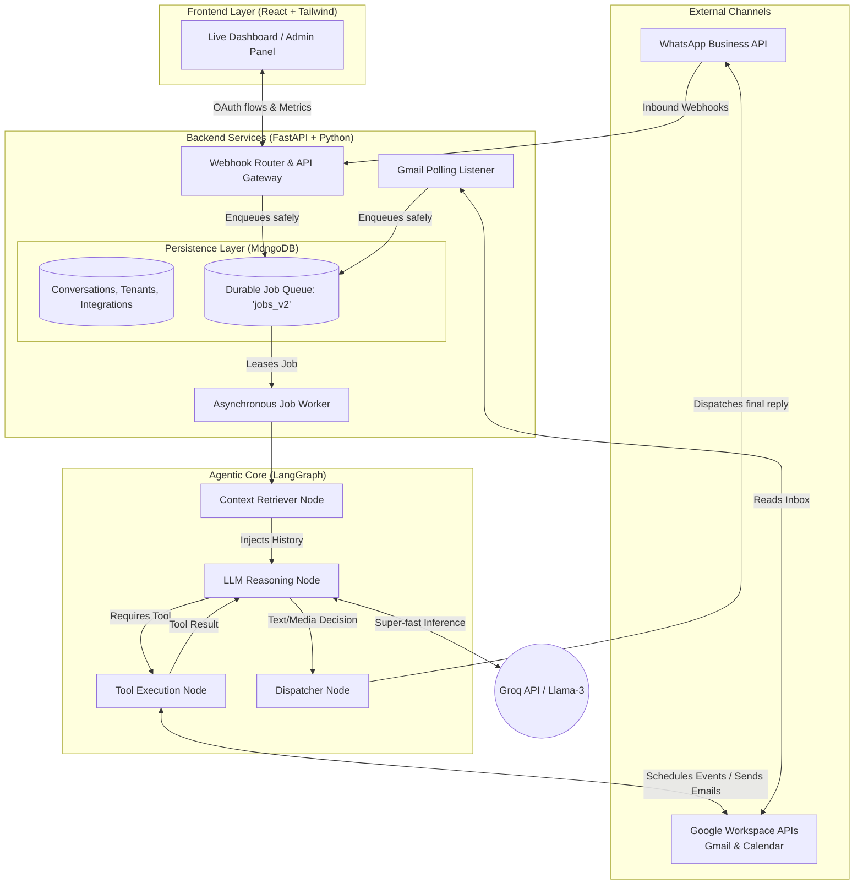

# Omnichannel Agentic SaaS - System Architecture

This document outlines the high-level architecture of the autonomous AI agent system, detailing how messages flow from external channels through our durable queues and into the LangGraph agentic core.

## High-Level Architecture Diagram

---

## System Components

### 1. Frontend Layer
* **Tech Stack:** React, TypeScript, Tailwind CSS, Vite.
* **Purpose:** Provides a dashboard for the business owner to monitor live chat sessions across WhatsApp and Gmail. It also handles the Google OAuth 2.0 flow, securely connecting the business owner's Google Calendar and Gmail inbox to the system.

### 2. API Gateway & Webhook Receivers
* **Tech Stack:** FastAPI.
* **Purpose:** Validates incoming payloads from the Meta WhatsApp Cloud API and safely normalizes them. Instead of processing LLM queries synchronously (which causes timeout crashes), it immediately drops incoming messages into a MongoDB Job Queue and returns `200 OK` to Meta.

### 3. Durable Job Queue & Worker
* **Tech Stack:** Motor (Async MongoDB), Python `asyncio`.
* **Purpose:** Ensures zero dropped messages. The `JobWorker` continuously polls the `jobs_v2` collection. If a temporary failure occurs (e.g., API rate limits or database connection drops), the worker gracefully fails the job and retries it using an exponential backoff algorithm.

### 4. Agentic Core (LangGraph)
The brain of the system is modeled as a state machine using LangGraph. Each step is isolated into specific "nodes":
* **Context Retriever:** Fetches the last *N* messages of history for the specific user session.
* **LLM Reasoning:** Sends the conversation history, available tools, and the latest prompt to the **Groq API**. Groq processes the Llama-3 model at extreme speeds. The LLM decides whether to respond directly or invoke a tool.
* **Tool Execution:** If the LLM requests a tool (e.g., `calendar_check_availability` or `gmail_reply_to_email`), this node executes the Python function using the stored Google OAuth tokens, and passes the result *back* to the LLM node.
* **Dispatcher:** Once the LLM finalizes its response, this node formats it and dispatches it back to the customer via the WhatsApp API.

## Message Lifecycle (Example: WhatsApp)

1. A customer sends "Schedule a meeting tomorrow" to the WhatsApp number.
2. Meta sends a POST webhook to the FastAPI Router.
3. The Router verifies the payload, queues it in MongoDB, and replies `200 OK` to Meta.
4. The Async Worker claims the job and triggers the LangGraph state machine.
5. LangGraph retrieves the chat history and asks Groq how to proceed.
6. Groq triggers `calendar_check_availability`. LangGraph executes the Google API call and returns the result to Groq.
7. Groq triggers `calendar_create_event`. LangGraph executes the Google API call and books the meeting.
8. Groq finalizes the reply: "I've booked your meeting!"
9. The Dispatcher node sends this final text back to Meta.
10. The Job is marked as `Completed` in MongoDB.
