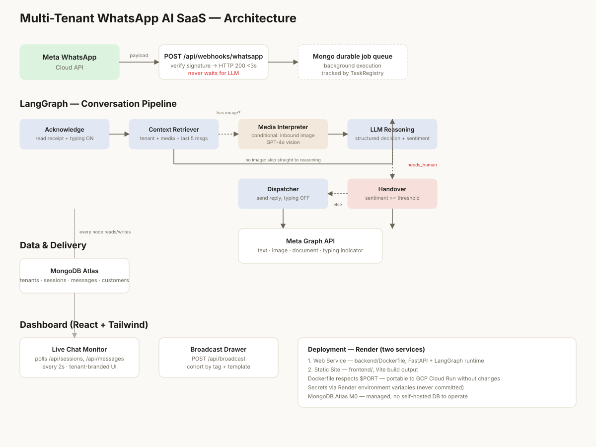

# Omni-Channel AI SaaS (Built for AIONOS)

Welcome! This is a production-ready, autonomous AI agent built to demonstrate next-generation customer support and sales capabilities for **AIONOS**. 

Instead of a simple chatbot, this system acts as a proactive digital employee capable of managing multiple businesses at once. Built with **FastAPI + LangGraph + Groq (Llama 3)** on the backend and a **React + Tailwind** dashboard on the frontend.

## 🌟 Core Capabilities
* **Omni-Channel Communication:** Customers can text the business on **WhatsApp** or send an email via **Gmail**. The AI agent seamlessly reads, reasons, and replies on the exact same channel the customer used.
* **Autonomous Calendar Scheduling:** The agent connects directly to Google Calendar via OAuth. If a customer asks to book a meeting, the AI checks the business\'s availability, books the time slot, and automatically invites the customer.
* **Blazing Fast AI:** Powered by Llama 3 via Groq, providing near-instantaneous reasoning and responses.
* **Human Handover:** The system constantly monitors customer sentiment. If a customer gets frustrated or explicitly asks for a human, the AI stops replying and flags the conversation in red on the dashboard so a real person can step in.
* **Live Admin Dashboard:** A beautiful React-based control center where operators can watch the AI talk to customers in real-time, view chat histories across different channels, and broadcast messages.

---

## 🚀 Setup From Scratch

### Step 1: Gather Your API Keys
You will need a few free accounts to make this work:
1. **MongoDB Atlas:** Create a free cluster and get your connection string (\MONGODB_URI\).
2. **Groq:** Go to console.groq.com to get your ultra-fast API key (\GROQ_API_KEY\).
3. **Google Cloud Console:** Create an OAuth 2.0 Client ID to get your \GOOGLE_CLIENT_ID\ and \GOOGLE_CLIENT_SECRET\.
4. **Meta Developers:** Create a WhatsApp app to get your \META_ACCESS_TOKEN\ and \META_PHONE_NUMBER_ID\.

### Step 2: Configure the Backend
1. Open your terminal, clone the repo, and navigate to the backend:
   \\ash
   git clone https://github.com/lightningninja-01/krid_KAWS.git
   cd krid_KAWS/backend
   \2. Copy the environment template and open it:
   \\ash
   cp .env.example .env
   \3. Fill in the keys you gathered in Step 1 into the \.env\ file.

### Step 3: Seed the Database
This system is built for multiple tenants (businesses). Run the setup script to generate the initial demo businesses:
\\ash
pip install -r requirements.txt
python -m scripts.seed_db
\
### Step 4: Configure the Frontend
Open a new terminal window and navigate to the frontend:
\\ash
cd ../frontend
cp .env.example .env
npm install
\*(Ensure \VITE_API_BASE_URL\ in your frontend \.env\ points to your backend, e.g., \http://localhost:5000\)*

### Step 5: Start the Engines!
Run both servers to bring the agent online:

**Terminal 1 (Backend):**
\\ash
cd backend
uvicorn app.main:app --reload --port 5000
\**Terminal 2 (Frontend):**
\\ash
cd frontend
npm run dev
\
---

## 🖥️ Navigating the Application

Because this is a SaaS platform, the frontend has two main areas:
* **The Public Sandbox (\/demo\ or \/\):** This is the landing page where users can simulate incoming WhatsApp messages to see how the AI reacts.
* **The Admin Dashboard (\/admin\):** Navigate to \http://localhost:5173/admin\ (or \your-website.com/admin\ in production) to open the live control center. Here you can switch between businesses (tenants), view the live AI chat history, and monitor active sessions!

---

## 🏗️ Technical Architecture (For Advanced Users)

### LangGraph Workflow
The backend uses LangGraph to orchestrate the AI\'s reasoning loop:
\Acknowledge -> Context Retriever -> (conditional: inbound image?)
                                        |- yes -> Media Interpreter -> LLM Reasoning
                                        |- no  -------------------> LLM Reasoning

LLM Reasoning -> (conditional: action type?)
                     |- tool_call -> Tool Execution -> (loops back to LLM Reasoning)
                     |- respond   -> (conditional: needs_human?)
                                         |- yes -> Handover   -> END
                                         |- no  -> Dispatcher -> END
\* **Tool Execution:** Securely executes the LLM\'s requested tools (like pulling Google OAuth tokens to check calendar availability) and feeds the result back into the LLM context.
* **Dispatcher:** Dynamically routes the final LLM response back to the originating channel (WhatsApp or Gmail API).

### Deployment (Render)
This project deploys easily to Render as two separate services:
1. **Backend (Web Service):** Point Render to the \ackend/\ directory using the Docker environment. Add all \.env\ variables to Render\'s Environment tab.
2. **Frontend (Static Site):** Point Render to the \rontend/\ directory. Build command: pm install && npm run build\. Publish directory: \dist\. Add a Rewrite Rule (Source: \/*\, Destination: \/index.html\, Action: \Rewrite\) to ensure the \/admin\ routing works in production.
